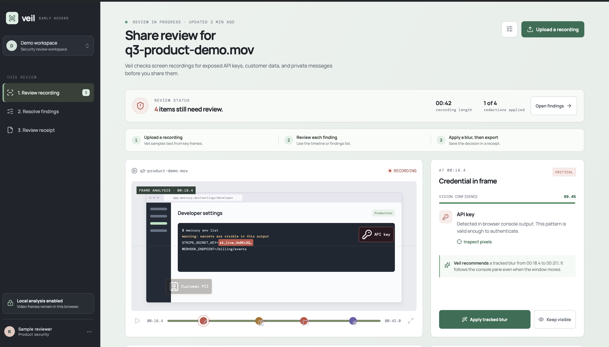

# Veil

> A browser-based privacy preflight for screen recordings.

Veil checks product demos and screen recordings for accidentally exposed API keys, customer data, and private messages before they are shared. It surfaces the moment of exposure, supports a tracked-redaction decision, and produces a review receipt documenting what changed.

**[Open the live demo →](https://tam2vec.github.io/Veil/)**



## Why I built this

Screen recordings are easy to share and easy to get wrong. A product demo can accidentally reveal credentials, customer information, or private team conversations in a single frame. Veil explores a privacy-first review step that happens before a recording leaves the team.

## How it works

1. Upload a screen recording.
2. Veil samples frames locally in the browser.
3. OCR reads visible text and checks for common API-key, email, and phone-number patterns.
4. Findings appear in a timeline and review ledger.
5. Apply a tracked blur or explicitly keep a finding visible.
6. Export a review receipt documenting the result.

## What this demonstrates

- Browser-side video handling
- Frame sampling with the Canvas API
- OCR with Tesseract.js
- Pattern matching for sensitive text
- Interactive privacy-review and redaction UX
- Local-first privacy design: recordings are not uploaded to an application server

## Privacy

This prototype processes sampled video frames locally in the browser. It does not send recordings to an application server. The OCR library is loaded from a CDN, so an internet connection is needed the first time it is used.

## Prototype limitations

- OCR accuracy depends on video quality and readable on-screen text.
- The prototype samples a small number of frames rather than every frame.
- It detects common text-based patterns; it does not yet detect faces, full visual PII, or every secret format.
- The tracked-blur interface is a prototype interaction; it does not export a redacted video file yet.

## Run locally

Open `index.html` in a browser, or run:

```bash
npm test
```

The test command verifies that the core interface and local OCR workflow are present.

## Tech

- HTML, CSS, and JavaScript
- [Tesseract.js](https://github.com/naptha/tesseract.js) for browser-side OCR
- [Lucide](https://lucide.dev/) icons

## Next steps

1. Add face detection and visual classification for non-text private surfaces.
2. Add exportable redacted video output.
3. Store immutable review receipts and reviewer approvals.
4. Add policy packs for sales demos, support recordings, and regulated teams.
